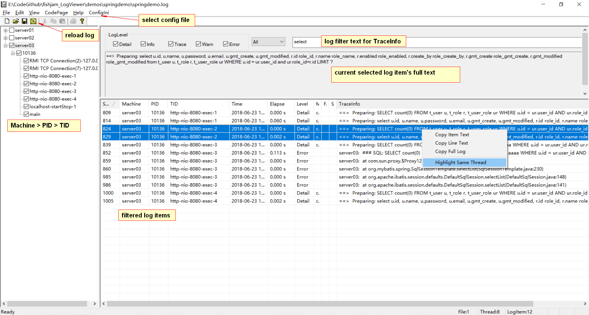

# TODO
 - [ ] Support pipe source, so can support real-time log(tail -f xxx | adb logcat | idevicelogsys | etc.)
 - [ ] change "PID+TID" (Plane Structure) to "Server>PID>TID"(Tree Structure)

# LogViewer
  - 一个通用的日志查看器. 可以通过用户配置的正则表达式解析文本格式的日志文件(如 Spring-Boot, Android, iOS, Visual Studio 等的文本日志), 然后进行显示,搜索,过滤,分析等. ***理论上说,只要能写出日志文件的正则表达式,即可通过这个工具分析任何一种日志格式***.
 
# 功能点
  - 1.在 ini 中配置好每行日志的正则表达式(REGULAR), 即可按其解析日志, 并通过 REGMAP 部分将解析结果映射到日志的各种对应项(如 Level/PID/TID等).
  - 2.只要日志文件中有对应的内容, 即可按照 Level(日志等级), PID(进程ID), TID(线程ID) 进行分组和过滤, 支持搜索过滤等; 
  - 3.自动分析出同一线程前后两条日志的耗时, 从而方便确认性能问题;
  - 4.可以按任意列进行排序.
  - 5.如果日志中有文件名/行号(Visual Studio格式), 双击日志的话,可以通过VS打开文件并定位.
 
# 日志配置
  - 0.示例文件参见 [Standard-SpringBoot.ini](x64/Release/Standard-SpringBoot.ini) 等,对应的示例日志文件为 [spring log demo](demos/springdemo.zip)
  - 1.COMMON 
    - REGULAR : 定义了一行日志的正则表达式,此为日志解析的核心部分, 推荐使用 Regex Match Tracer 等工具编写和确认正则表达式.
    - TIME_FORMAT : 定义了时间部分的格式, 目前只支持 yyyy-MM-dd HH:mm:ss.SSS 等四种格式, 配置好以后可以自动计算同一线程中前后两条日志的时间差(Elapse)
  - 2.REGMAP : 定义了正则解析出的各个分组对应日志的哪个部分, 如 ITEM_LEVEL 对应日志等级部分.
  - 3.LEVELMAP: 定义了日志等级的对应方式, 如 LEVEL_TRACE=INFO 表示日志中的 "INFO" 对应 LogViewer 中的 "Trace" 等级的日志, 可通过其进行过滤.

#  注意
  - 1.本程序最早是为了查看我的 FTL(Fast Trace Log) 二进制日志格式而写, 偏重于功能和显示时的性能, 界面比较丑(也没那个美术细胞去优化)
  - 2.由于一开始分析的日志都不大(也就几十M), 因此采用了主线程中将全部日志读入内存的方式, 从而快速的过滤/查找等, 因此不要直接去开几个G的 catalina.log 等.
  - 3.程序使用了我写的FTL(Fishjam Template Library)的代码. 其作为我的 学习笔记 + 内联库, 将需要的部分放了上来. 里面的东西比较杂, 而且没有放上 Demo 和 UT, 看起来会比较吃力(将就着看吧, 有问题可以联系). 
  
# TODO
  - 1.目前 PID 和 TID 的关系为并列关系, 但实际上应该为 PID > TID 的树状关系. 由于现在分析日志时几乎都会删除旧日志, 只有一个PID. 没有更改的动力.
  
# 程序主界面

